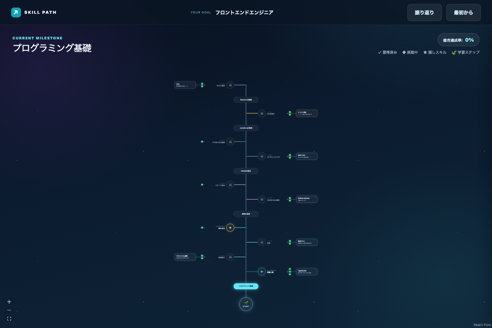
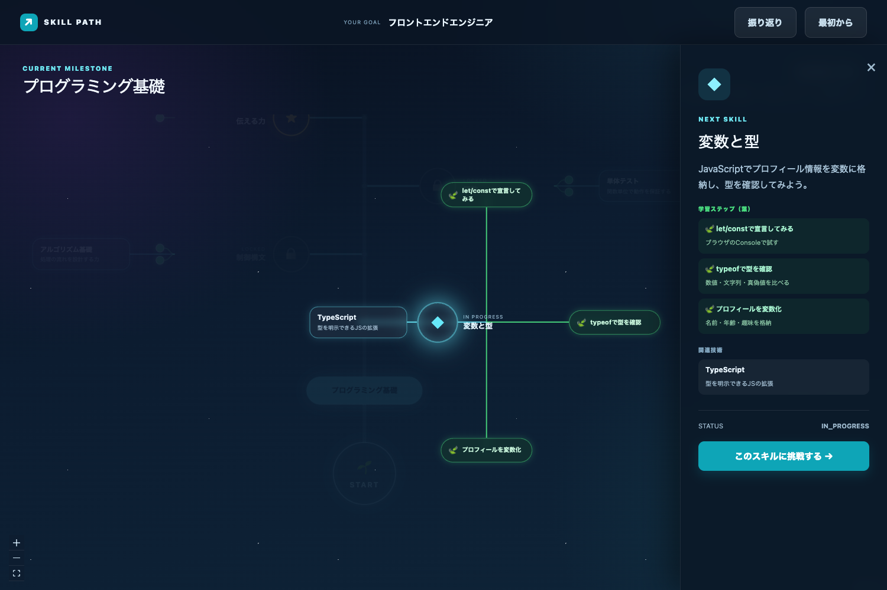
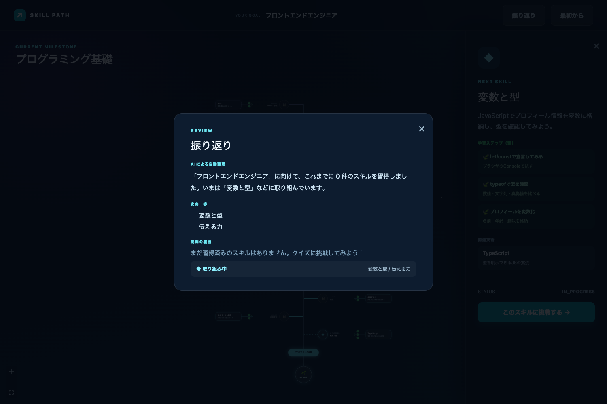
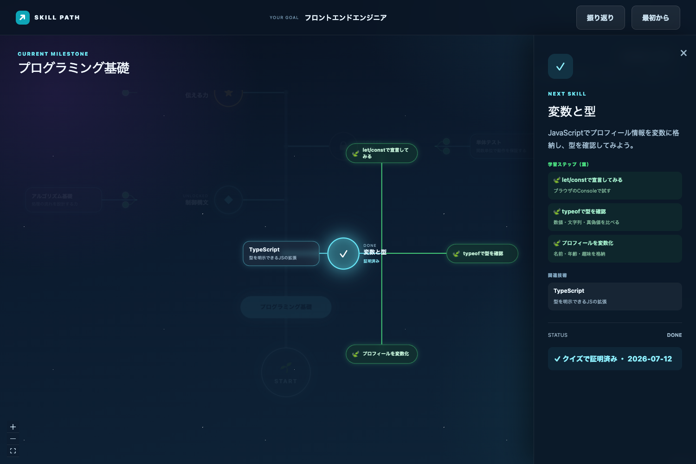

# スキルツリーUI 構成ドキュメント

スキルツリー画面の全体構成・フォーカス演出・振り返り機能・AIパイプラインをまとめる。
(スクリーンショットは `docs/assets/` に格納)

## 1. ビュー構成: 全体ビュー ⇄ フォーカスビュー

### 1.1 全体ビュー(ツリーモード)



- **中央幹レイアウト**: 下部の START 円 → 縦の幹 → 幹上のマイルストーンピル → 左右交互のスキルバブル
- **ノードは円形のガラスバブル**(ダーク宇宙背景+マイルストーン別ネオンアクセント)
- **葉(learning step)は小さな緑の芽(ドット)** としてスキルの外側に表示。
  ラベルは出さないため、**葉同士が重なって読めなくなる問題は起きない**
- **関連技術**は小さなガラスピルとして芽のさらに外側に枝分かれ
- ヘッダー下に**総合達成率バッジ**(done ノード数 / 全ノード数)
- ステータス表現: done=アクセント塗り+✓ / in_progress=パルス発光 / locked=減光+🔒 / 隠しスキル=アンバー★

### 1.2 フォーカスビュー(要素ピックアップ)



- スキルバブルをクリックすると**フォーカスモード**へ:
  - 選択ノードを中心に、**葉(ラベル付きピルに展開)と関連技術が円形に引き寄せられる**
  - 他の要素は不透明度 0.07 までフェードし、カメラが `fitView(duration)` でズームイン
  - ノード位置は CSS transition(`transform .75s`)で滑らかに移動 = **引き寄せエフェクト**
- 中心から各衛星へ放射状の直線エッジ(葉=緑 / 関連技術=アクセント色)
- 背景(何もない場所)をクリックすると全体ビューへ戻る(逆再生アニメーション)
- 同時に右の**詳細パネル**が開き、学習ステップ(葉)・関連技術・ステータス・クイズ挑戦ボタンを表示


## 2. 振り返り(レビュー)機能



ヘッダーの「振り返り」ボタンでモーダルを開く。

- **AIによる自動整理**: モーダルを開くと自動で `summarize-activity` Edge Function を呼び、
  習得済み/取り組み中のスキルから「要約・ハイライト・次の一歩」を生成して表示。
  AI が使えない場合はツリーデータからローカル生成にフォールバック
- **挑戦の履歴**: done ノードの一覧(合格日・スコア)と取り組み中スキルを常時表示。
  ツリーデータ(`evidence`)から導出するためオフラインでも参照できる

## 3. ノード階層とデータ構造

```
SkillTree (goal)
└─ Milestone(木)     … 幹上のピル。status: completed/current/upcoming/locked
   └─ SkillNode(枝)  … スキルバブル。status: done/in_progress/unlocked/locked, kind: normal/hidden
      ├─ Leaf(葉)     … 学習ステップ 2〜4枚 {id,label,description,status}
      └─ RelatedTech  … 関連技術 0〜4件 {id,label,note}
```

- 全体は `trees.tree_data`(jsonb)に丸ごと保存。葉・関連技術は枝に埋め込み
- `prerequisite_ids` が解放判定の正。依存エッジは描画せず、並び順とロック表示で表現

## 4. AIパイプラインと管理

```
オンボーディング → generate-questions(深掘り質問)
              → generate-tree(木+枝+葉+関連技術を一括生成)
ツリー画面     → generate-quiz(枝単位のクイズ) → grade-quiz(DB内トランザクション採点)
振り返り       → summarize-activity(学習記録のAI自動整理)
```

- **プロンプト管理**: `supabase/functions/_shared/prompts/` に関数ごとのモジュール
  (system プロンプト / JSONスキーマ / `promptVersion` / buildPrompt)+ `tuning.ts`(temperature・timeout・リトライ)
- **入出力ログ**: すべてのAI呼び出しは `runGeneration` 経由で `generation_logs` テーブルと
  コンソールに記録(prompt_version・model・input・raw_output・latency_ms・エラー)
- **フォールバック**: AI失敗時は各関数がデモデータ/テンプレートを返し、体験が止まらない

## 5. 主要ファイル

| 役割 | ファイル |
|---|---|
| レイアウト計算(全体/フォーカス) | `src/lib/treeLayout.ts` |
| ノード部品(バブル/幹/葉/関連/START) | `src/components/SkillNodeCard.tsx`, `src/components/treeNodes.tsx` |
| ツリー画面(フォーカス状態・ズーム) | `src/pages/SkillTreePage.tsx` |
| 振り返りモーダル | `src/components/ReviewModal.tsx` |
| クイズモーダル | `src/components/QuizModal.tsx` |
| API層(フォールバック含む) | `src/lib/api.ts` |
| スキーマ(唯一の正) | `shared/schemas/tree.ts`, `quiz.ts`, `activity.ts` |
| Edge Functions | `supabase/functions/{generate-questions,generate-tree,generate-quiz,grade-quiz,summarize-activity}` |
| プロンプト/チューニング | `supabase/functions/_shared/prompts/` |
| DB(テーブル・採点関数・生成ログ) | `supabase/migrations/` |

## 6. クイズ〜成長のループ

1. フォーカスビューで「このスキルに挑戦する」→ クイズ生成(正解はサーバーのみ保持)
2. 回答 → `grade_quiz_transaction` が1トランザクションで採点・done化・依存解放・achievement記録
3. ツリーに反映(done バブル発光・達成率上昇)→「振り返り」でAIが自動整理


